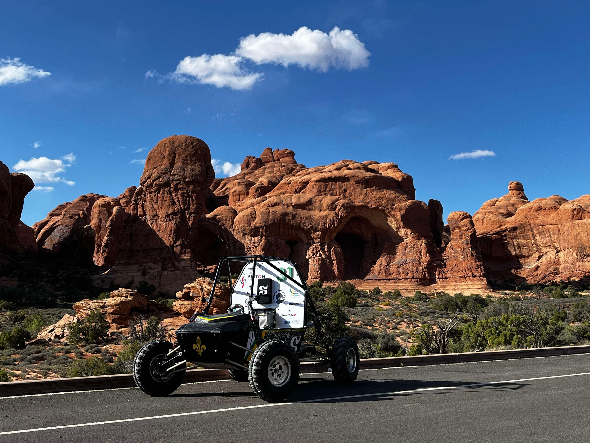
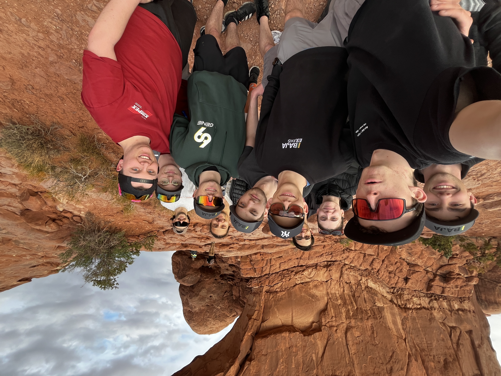
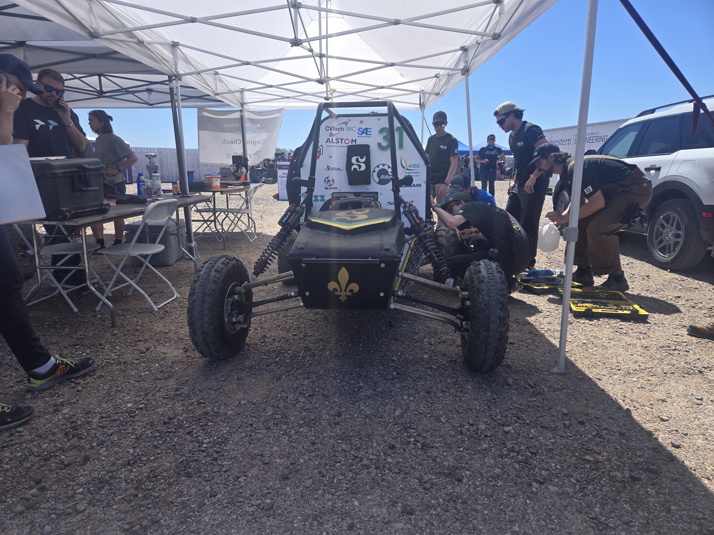
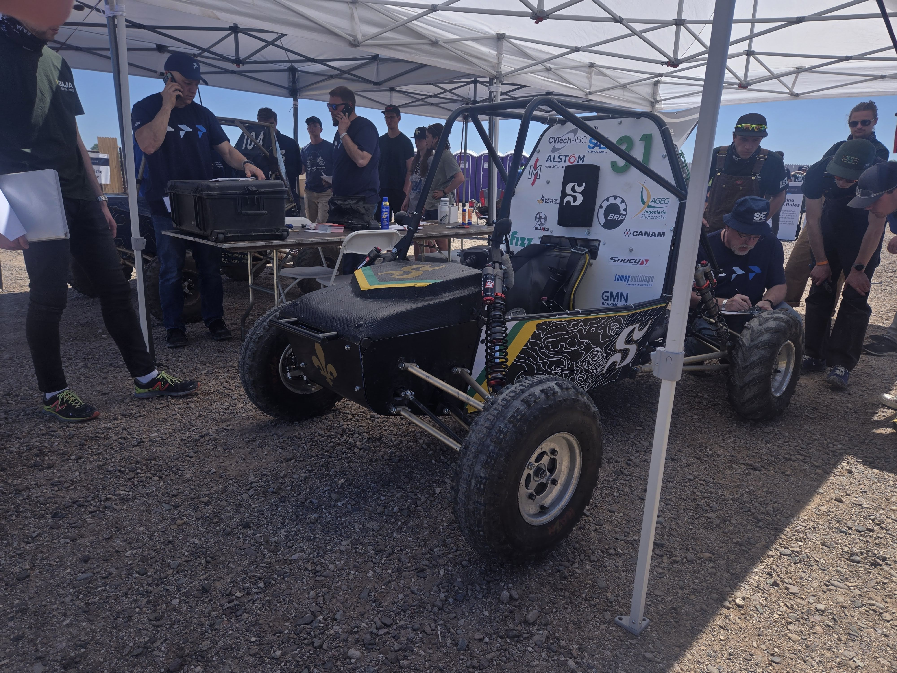

# Baja UdeS

## Project Overview
Baja SAE is a prestigious collegiate design competition organized by the Society of Automotive Engineers International, challenging university teams worldwide to design, build, and race single-seat, all-terrain vehicles. Originating at the University of South Carolina in 1976 with only 10 teams, the competition has evolved into a premier engineering design series with over 110 university teams participating annually. 

The competition simulates real-world engineering challenges, requiring students to develop off-road vehicles capable of withstanding harsh terrain conditions. Teams must create a prototype for a reliable, maintainable, ergonomic, and economically viable production vehicle targeting the recreational user market. The challenge extends beyond vehicle performance, encompassing comprehensive design documentation, cost analysis, sales presentations, and technical inspections.

Baja SAE competitions feature both static events (design judging, cost evaluation, sales presentations) and dynamic events (acceleration, hill climbs, maneuverability, endurance races). All vehicles utilize a standardized 14 hp Kohler Command Pro CH440 engine with a modified restrictor plate, creating a level playing field that emphasizes innovative engineering design and manufacturing excellence over raw power. Since 2022, all cars must incorporate 4WD drivetrain systems, further challenging teams to develop cutting-edge solutions. This multifaceted competition prepares students for careers in automotive engineering while fostering teamwork, project management, and technical communication skills essential for professional success.

## Team Members
[Meet the team on our website here](https://bajaudes.weebly.com/eacutequipe.html)

## Timeline
- **Start Date:** YYYY-MM-DD
- **End Date:** YYYY-MM-DD
- **Key Milestones:**
  - Milestone 1: Description
  - Milestone 2: Description

## Design and Development
### Conceptual Design
Explain the initial design concepts and ideas.

### Prototyping
Detail the prototyping process and iterations.

### Final Design
Provide information about the final design, including diagrams or images if available.

## Challenges and Solutions
Discuss the challenges faced during the project and how they were addressed.

## Results and Achievements
Highlight the outcomes, achievements, and any awards or recognitions received.

## Future Work
Outline potential improvements or next steps for the project.

## Contact Information
[Team website](https://bajaudes.weebly.com/)

## Gallery

