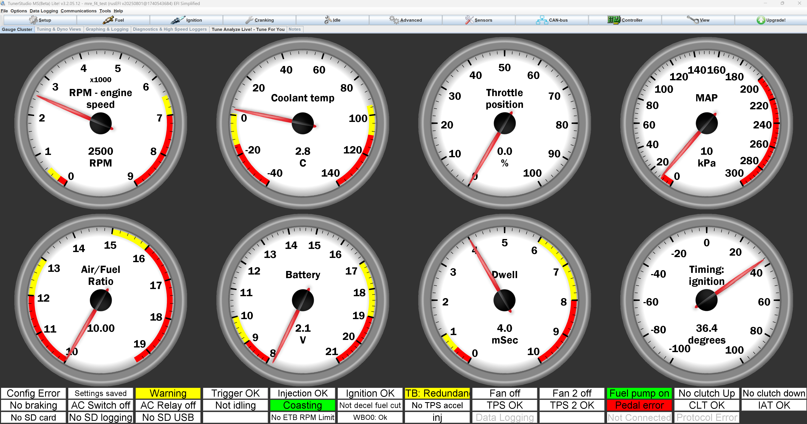

# Micro rusEFI

## Project Overview
### rusEFI mission statement:
rusEFI is a group of enthusiasts developing a fundamentally smarter open source ECU. As of 2022, we have built an amazing foundation which is good enough to run any simple engine as is. Current software and universal hardware and offerings aim to cater to those interested in further development.

### What is an ECU?
An Electronic Control Unit (ECU) is the brain of a modern vehicle's engine management system. This sophisticated computer continuously monitors engine sensors, including air flow, temperature, throttle position, and oxygen levels, to optimize fuel injection timing, ignition timing, and air-fuel mixture ratios. The ECU processes thousands of calculations per second to ensure optimal engine performance, fuel efficiency, and emissions compliance. By precisely controlling these parameters in real-time, the ECU maximizes power output while minimizing fuel consumption and harmful emissions, making it essential for modern automotive operation.

### Micro rusEFI
microRusEFI is a small & cheap Engine Management System board designed for fully sequential 1, 2, 3 and 4 cylinder applications.
microRusEFI uses a waterproof connector and its aluminum enclosure could be sealed.
microRusEfi supports dual Hall shaft position sensor input or 1xHall + 1xVR shaft position sensor input (A few resistors must be replaced on the PCB to switch from one setup to another)
Open-source design available in this [repository](https://github.com/rusefi/hw_microRusEfi), or available as a [completely assembled ECU](https://www.shop.rusefi.com/shop/p/microrusefi-assembled-ecu-development-module).
This is an excellent option for racing series that allow modifications inside the stock ECU case.

#### Features:
- Primary VR or Hall input (configurable with few resistor changes)
- Secondary Hall input
- 4 analog thermistor (temperature) inputs
- 10 analog voltage inputs (0-5v)
- 4 high-Z injector outputs
- 2 high-current low side outputs for IAC/VVT/other solenoids
- Dedicated main relay control output
- 4 low-current low side outputs for relays or warning lights
- 4 5v logic-level ignition outputs
- 2 logic level outputs (5v/12v configurable, requires resistor changes)
- Electronic throttle body (drive by wire)
- CAN connectivity on the plug
- USB connectivity on the plug
- SPI and TTL available on PCB

### My contribution
When looking over the PCB for this open source project I wanted to reproduce as an engine tuning learning opportunity, I realized that the USB traces were not routed as a proper differential pair. I modified the PCB design to have proper differential traces with a somewhat controlled impedance. While I was at it, I also updated the original microUSB connector with a USB-C connector for better durability.

[The project fork can be found here.](https://github.com/RacoonDOEggs/hw_microRusEfi_usb_c)

## Design and Development
### Conceptual Design
The routing design was calculated using the differential pair calculator from [Saturn PCB Toolkit V8.41](https://saturnpcb.com/saturn-pcb-toolkit/).

Here are the results of the calculation:

Another design choice was to use a through-hole vertical USB-C connector. This choice might be unusual, but the vertical connector allows the board to fit inside the original OEM case specified by the original project, making it a drop-in replacement and saving me from designing a new case. A through-hole connector was chosen because, since the board is not meant to be produced in high quantities, the through-hole assembly does not add too much cost and allows for a sturdier connector that will not rip off the board when unplugging the USB cable.

## Challenges and Solutions
The original board is very dense and had only 2 layers, making it nearly impossible to have proper shielding to control the impedance of the traces. This meant that the PCB had to be changed to a 4 layer board and many traces had to be rerouted to work with the new USB routing and grounding solution.

## Results and Achievements
The USB functionality works properly and the device is recognized by TunerStudio. TunerStudio is an affordable software package used to tune ECUs to each engine. 

## Future Work
This ECU has yet to be mounted in a car to properly control an engine. This page will be updated once this has been successfully achieved.

## Gallery

