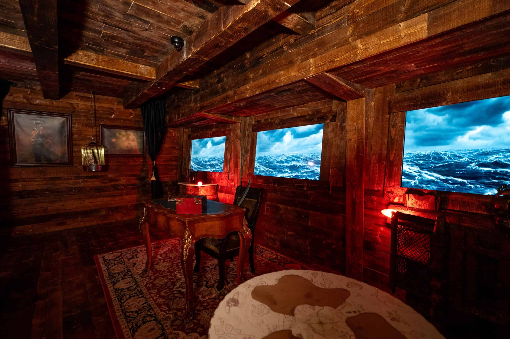

# Pirate Cove

## Project Overview
Describe the purpose, goals, and significance of the project.

## Design and Development
### Conceptual Design
Explain the initial design concepts and ideas.

### Prototyping
Detail the prototyping process and iterations.

### Final Design
Provide information about the final design, including diagrams or images if available.

## Challenges and Solutions
Discuss the challenges faced during the project and how they were addressed.

## Results and Achievements
Highlight the outcomes, achievements, and any awards or recognitions received.

## Future Work
Outline potential improvements or next steps for the project.

## Gallery

## Contact Information
Provide contact details for inquiries or further information.