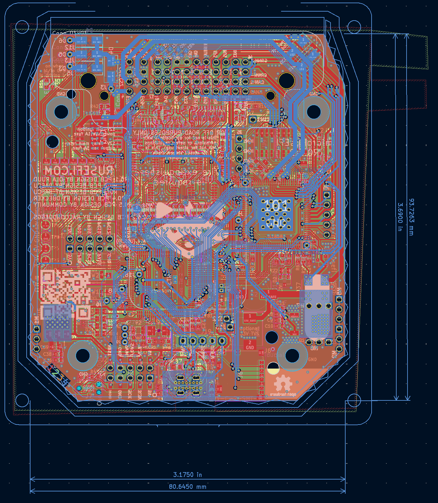
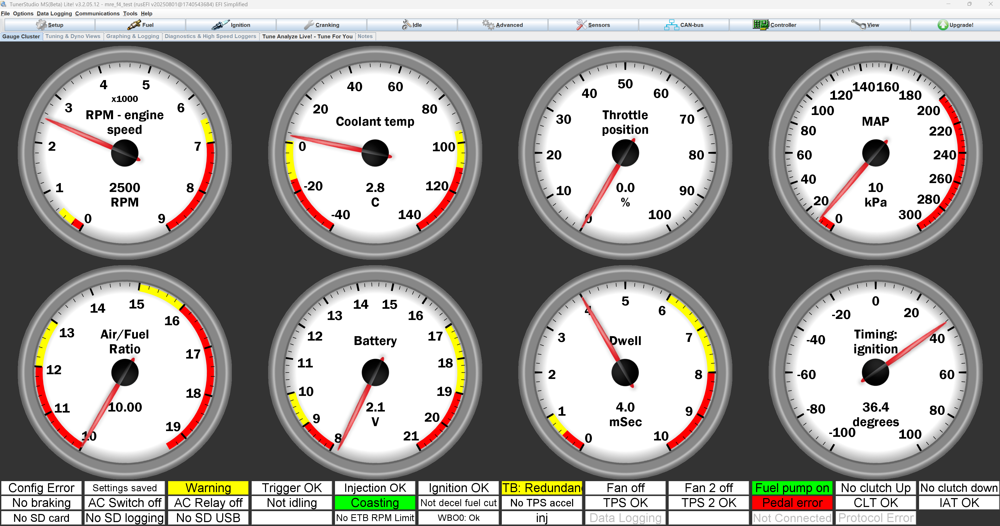

# Micro rusEFI

## Aperçu du projet
### Mission de rusEFI :
rusEFI est un groupe d'enthousiastes développant une ECU open source fondamentalement plus intelligente. En 2022, nous avons construit une base solide qui est suffisamment bonne pour faire fonctionner n'importe quel moteur simple tel quel. Le logiciel et les offres matérielles universelles actuels visent à répondre aux besoins de ceux qui s'intéressent au développement ultérieur.

### Qu'est-ce qu'une ECU ?
Une Unité de Contrôle Électronique (ECU) est le cerveau du système de gestion moteur d'un véhicule moderne. Cet ordinateur sophistiqué surveille en permanence les capteurs du moteur, notamment le débit d'air, la température, la position de l'accélérateur et les niveaux d'oxygène, pour optimiser le timing d'injection de carburant, le timing d'allumage et les ratios du mélange air-carburant. L'ECU traite des milliers de calculs par seconde pour assurer des performances moteur optimales, l'efficacité énergétique et la conformité aux émissions. En contrôlant précisément ces paramètres en temps réel, l'ECU maximise la puissance de sortie tout en minimisant la consommation de carburant et les émissions nocives, la rendant essentielle pour le fonctionnement automobile moderne.

### Micro rusEFI
microRusEFI est une carte de Système de Gestion Moteur petite et économique conçue pour des applications à 1, 2, 3 et 4 cylindres entièrement séquentielles.
microRusEFI utilise un connecteur étanche et son boîtier en aluminium peut être scellé.
microRusEfi prend en charge l'entrée de capteur de position d'essieux double Hall ou 1xHall + 1xVR (Quelques résistances doivent être remplacées sur le PCB pour passer d'une configuration à l'autre)
Conception open-source disponible dans ce [repo](https://github.com/rusefi/hw_microRusEfi), ou disponible comme [ECU entièrement assemblée](https://www.shop.rusefi.com/shop/p/microrusefi-assembled-ECU-development-module).
C'est une excellente option pour les séries de course qui autorisent les modifications à l'intérieur du boîtier ECU d'origine.

#### Caractéristiques :
- Entrée VR ou Hall primaire (configurable avec quelques changements de résistances)
- Entrée Hall secondaire
- 4 entrées analogiques thermistors (température)
- 10 entrées analogiques de tension (0-5v)
- 4 sorties d'injecteurs haute impédance
- 2 sorties côté bas haute intensité pour IAC/VVT/autres solénoïdes
- Sortie de contrôle de relais principal dédiée
- 4 sorties côté bas basse intensité pour relais ou voyants d'avertissement
- 4 sorties d'allumage niveau logique 5v
- 2 sorties niveau logique (5v/12v configurable, nécessite des changements de résistances)
- Corps de papillon électronique (commande par câble)
- Connectivité CAN sur la prise
- Connectivité USB sur la prise
- SPI et TTL disponibles sur PCB

### Ma contribution
En examinant le PCB de ce projet open source que je voulais reproduire comme opportunité d'apprentissage du réglage moteur, j'ai réalisé que les traces USB n'étaient pas routées comme une paire différentielle appropriée. J'ai modifié la conception du PCB pour avoir des traces différentielles appropriées avec une impédance quelque peu contrôlée. Pendant que j'y étais, j'ai aussi mis à jour le connecteur microUSB original avec un connecteur USB-C pour une meilleure durabilité.

[Le fork du projet peut être trouvé ici.](https://github.com/RacoonDOEggs/hw_microRusEfi_usb_c)

## Conception et Développement
### Conception Conceptuelle
La conception du routage a été calculée en utilisant le calculateur de paire différentielle du [Saturn PCB Toolkit V8.41](https://saturnpcb.com/saturn-pcb-toolkit/).

Voici les résultats du calcul :

Un autre choix de conception était d'utiliser un connecteur USB-C vertical through-hole. Ce choix peut sembler inhabituel, mais le connecteur vertical permet à la carte de s'adapter à l'intérieur du boîtier OEM original spécifié par le projet original, en faisant un remplacement direct et m'économisant ainsi la conception d'un nouveau boîtier. Un connecteur through-hole a été choisi car, puisque la carte n'est pas destinée à être produite en grandes quantités, l'assemblage through-hole n'ajoute pas trop de coût et permet un connecteur plus solide qui ne se détachera pas de la carte lors du débranchement du câble USB.

## Défis et Solutions
La carte originale est très dense et n'avait que 2 couches, rendant presque impossible d'avoir une protection électromagnétique appropriée pour contrôler l'impédance des traces. Cela signifiait que le PCB devait être changé en une carte à 4 couches et de nombreuses traces devaient être reroutées pour fonctionner avec le nouveau routage USB et la solution de mise à la terre.

## Résultats et Réalisations
La fonctionnalité USB fonctionne correctement et l'appareil est reconnu par TunerStudio. TunerStudio est un logiciel abordable utilisé pour régler les ECU à chaque moteur.

## Travail Futur
Cette ECU n'a pas encore été montée dans une voiture pour contrôler correctement un moteur. Cette page sera mise à jour une fois que cela aura été accompli avec succès.

## Galerie

